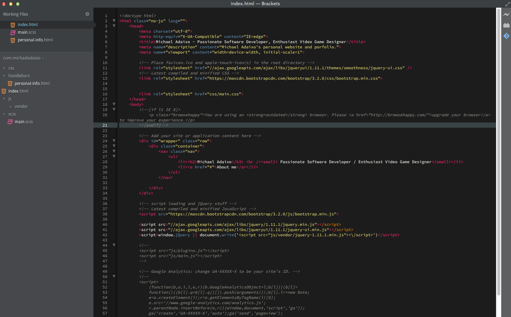
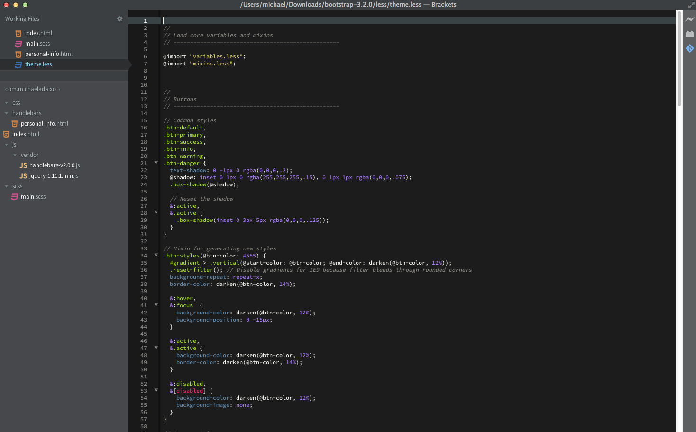
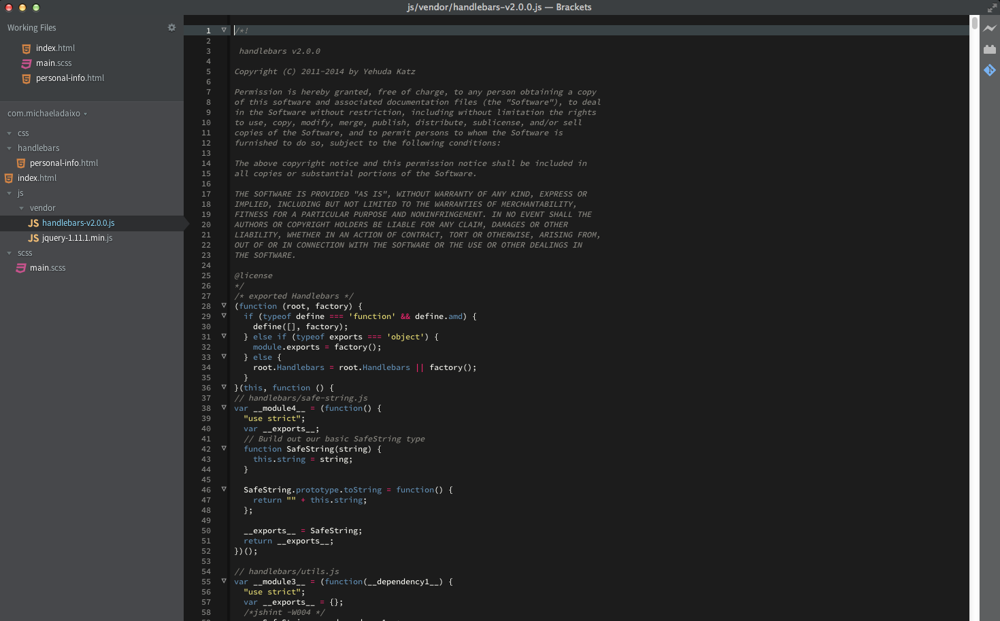

Brackets Theme: Son of Monokai
===

Installation
---

This extension requires Brackets Release 42 or newer.

1. Open Brackets
2. Open the extension manager
3. Search for ‘Monokai’
4. Click install

Screenshots
---

### HTML

### CSS

### JavaScript

License
---

The MIT License. Read [LICENSE](LICENSE) for further information.